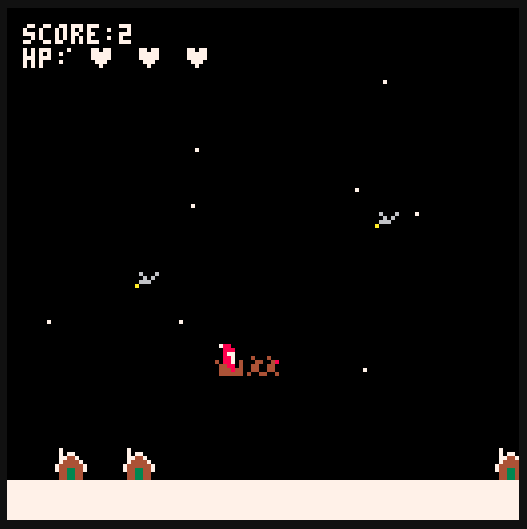

# Jogo de Natal no Pico-8

Este é um jogo de Natal desenvolvido no Pico-8 usando Lua. No jogo, o Papai Noel está entregando presentes com a ajuda de suas renas, mas precisa evitar colisões com as casas e os pássaros.

## Como Jogar

### Requisitos
- É necessário ter o ambiente de desenvolvimento Pico-8 para rodar o jogo.

### Instruções para Rodar o Jogo
1. Clone ou faça o download do repositório.
2. Abra o Pico-8 (Existe uma versão online e gratuita para fins educativos no link a seguir: [pico-8-edu](https://www.pico-8-edu.com/)).
3. Carregue o código Lua do jogo no Pico-8.
4. No Pico-8, execute o jogo digitando `RUN` no console e pressionando Enter.

## Recursos do Jogo

- Use as teclas direcionais para movimentar o Papai Noel.
- Pressione o botão de pulo para fazer o Papai Noel pular.
- O botão de ação permite que o Papai Noel lance os presentes.
- Evite colidir com obstáculos, como pássaros e naves.
- Entregue presentes nas casas para ganhar pontos.
- Cuidado com o medidor de vida - colisões reduzem a vida do Papai Noel.
- Ao perder todas as vidas, o jogo acaba.

## Funcionalidades
- **Movimento do Papai Noel:** O jogador pode mover o Papai Noel para esquerda, direita e realizar pulos.
- **Presentes:** Os presentes podem ser lançados pelo Papai Noel.
- **Obstáculos:** Pássaros voando e naves UFO são obstáculos a serem evitados.
- **Colisões:** Colidir com obstáculos diminui a vida do Papai Noel.
- **Pontuação:** Entregar presentes nas casas aumenta a pontuação do jogador.
- **Níveis de Dificuldade:** A velocidade do jogo aumenta conforme a pontuação.
- **Menu Interativo:** Opções de jogar e reiniciar estão disponíveis no menu principal.

## Controles
- Setas direcionais: Movimentar o Papai Noel.
- Botão de pulo: Fazer o Papai Noel pular.
- Botão de ação: Lançar presentes.

## Contribuição
Sinta-se à vontade para contribuir com melhorias no código ou adicionar novos recursos ao jogo.

### Como Contribuir
1. Faça um fork deste repositório.
2. Implemente suas melhorias ou adições.
3. Envie um pull request com uma descrição clara das mudanças propostas.

## Créditos
- Desenvolvido por [José Victor Martins Figueiredo](https://github.com/josevictormobilelink_do_seu_perfil).
- Mecânicas de jogo baseadas em um código original criado com o Pico-8.

Divirta-se jogando e contribuindo para o jogo de Natal no Pico-8! 🎅🎮
